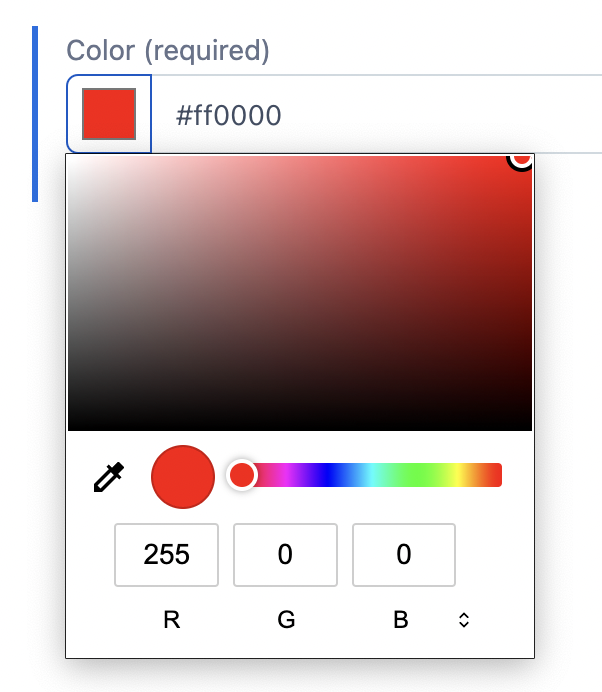

## Contentful Color Picker

  

A very simple color picker to display in the Short Text field of Contentful.

## Usages
1. [Install the app](https://app.contentful.com/deeplink?link=apps&id=7zWL8jaftvQT2luo92tMA3) to your organization.
2. Open the model > appearance tab for the `Short text` field, and activate the app.

## Development
`npm start` will launch the development environment in debug mode.

## Upload your own organizations

1. `npm install`
2. `npm run build`
3. `npm run upload`
